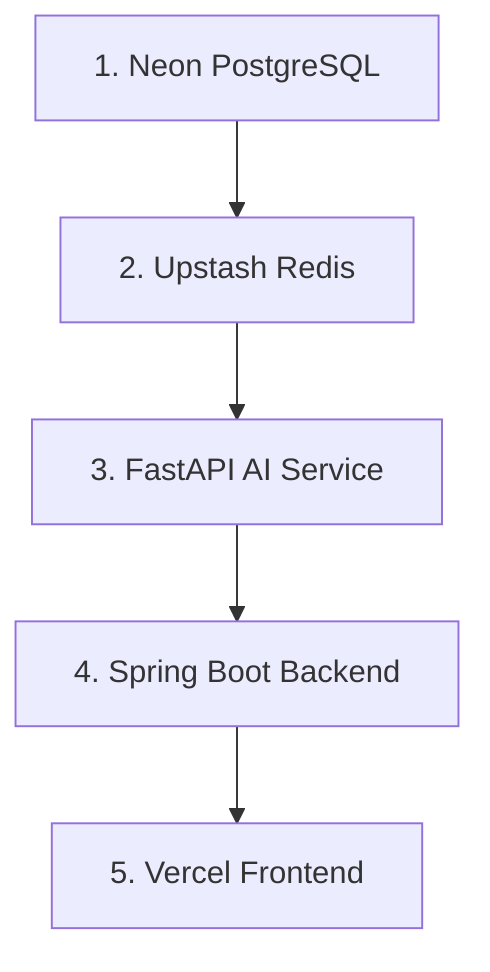

# 🚀 IntelliFlow Platform — Enterprise Deployment Checklist (100% Free Stack)

## 1. Required Cloud Accounts & Services

| Service | Provider | Tier / Plan | Purpose |
| :--- | :--- | :--- | :--- |
| **Frontend Hosting** | Vercel | Free / Hobby | Static Single-Page App (SPA) global CDN hosting |
| **Backend API** | Render | Free / Starter | Dockerized Spring Boot web service (JDK 21) |
| **AI Microservice** | Render | Free / Starter | Dockerized FastAPI AI microservice (Python 3.11) |
| **Relational Database** | Neon PostgreSQL | Free Tier | PostgreSQL 16 serverless instance with `pgvector` |
| **Cache Layer** | Upstash Redis | Free Tier | Serverless Redis instance for session & rate limiting |
| **LLM Provider** | Groq API | Free Tier | `llama-3.3-70b-versatile` (OpenAI compatible) |
| **Embedding Provider** | Hugging Face | Free / Local | `sentence-transformers/all-MiniLM-L6-v2` (384-dim) |

---

## 2. Required Environment Variables Matrix

### Spring Boot Backend (`intelliflow-backend`)
- `SPRING_PROFILES_ACTIVE`: `prod`
- `SPRING_DATASOURCE_URL`: `jdbc:postgresql://<neon-host>:5432/<dbname>?sslmode=require`
- `SPRING_DATASOURCE_USERNAME`: `<neon-user>`
- `SPRING_DATASOURCE_PASSWORD`: `<neon-password>`
- `SPRING_DATA_REDIS_HOST`: `<upstash-host>`
- `SPRING_DATA_REDIS_PORT`: `6379`
- `SPRING_DATA_REDIS_PASSWORD`: `<upstash-password>`
- `SPRING_DATA_REDIS_SSL`: `true`
- `JWT_SECRET`: Minimum 32-character / 256-bit entropy secret string
- `GROQ_API_KEY`: `gsk_...`
- `GROQ_MODEL_CHAT`: `llama-3.3-70b-versatile`
- `EMBEDDING_MODEL_NAME`: `sentence-transformers/all-MiniLM-L6-v2`
- `ALLOWED_ORIGINS`: `https://your-app.vercel.app`
- `AI_SERVICE_BASE_URL`: `https://intelliflow-ai-service.onrender.com`

### FastAPI AI Microservice (`intelliflow-ai-service`)
- `DATABASE_URL`: `postgresql+asyncpg://<neon-user>:<neon-password>@<neon-host>:5432/<dbname>`
- `REDIS_URL`: `rediss://default:<upstash-password>@<upstash-host>:6379/0`
- `GROQ_API_KEY`: `gsk_...`
- `GROQ_BASE_URL`: `https://api.groq.com/openai/v1`
- `GROQ_MODEL_CHAT`: `llama-3.3-70b-versatile`
- `EMBEDDING_MODEL_NAME`: `sentence-transformers/all-MiniLM-L6-v2`

### React Frontend (`intelliflow-frontend`)
- `VITE_API_BASE_URL`: `https://intelliflow-backend.onrender.com`
- `VITE_WS_BASE_URL`: `wss://intelliflow-backend.onrender.com/ws-notifications`

---

## 3. Strict Deployment Order Sequence

1. **Provision Neon Database**: Initialize PostgreSQL database and verify connection string.
2. **Provision Upstash Redis**: Create serverless Redis instance and copy TLS credentials.
3. **Deploy FastAPI AI Service on Render**: Deploy `Dockerfile.ai` with `GROQ_API_KEY`.
4. **Deploy Spring Boot Backend on Render**: Deploy `intelliflow-backend/Dockerfile` with Flyway automated migrations enabled.
5. **Deploy Frontend on Vercel**: Connect GitHub repository, build SPA via `npm run build`, and configure `vercel.json` rewrites.

---

## 4. Production Verification Checklist

- [ ] Verify Neon PostgreSQL accepts TLS connections and `pgvector` extension is enabled.
- [ ] Verify Upstash Redis connection via ping test over TLS.
- [ ] Verify FastAPI AI Service returns 200 OK on `/health`.
- [ ] Verify Spring Boot Backend returns `{"status":"UP"}` on `/actuator/health`.
- [ ] Verify Flyway migration `V1__init_schema.sql` successfully executed and created 384-dim HNSW vector index (`vector(384)`).
- [ ] Verify Frontend builds and renders clean UI without CORS errors on `/login` and `/dashboard`.
