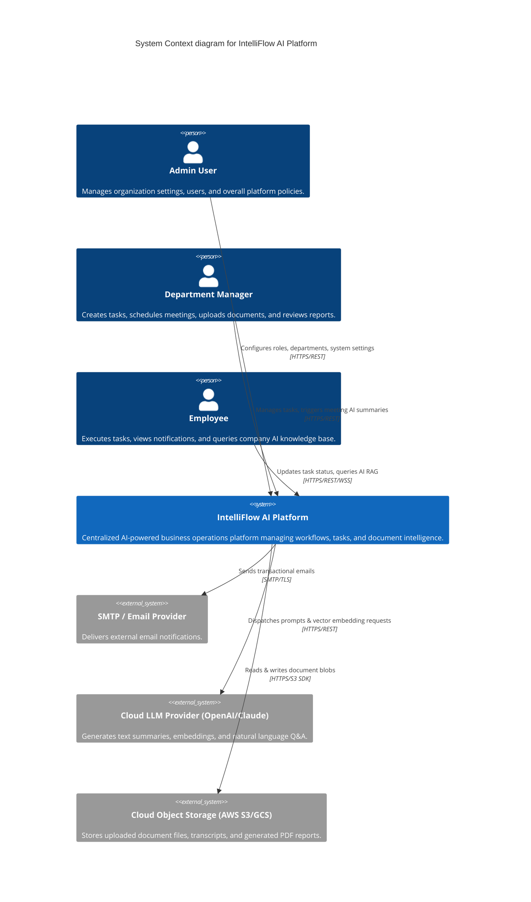

# C4 System Context Diagram: IntelliFlow AI Platform

```mermaid
C4Context
    title System Context diagram for IntelliFlow AI Platform

    Person(admin, "Admin User", "Manages organization settings, users, and overall platform policies.")
    Person(manager, "Department Manager", "Creates tasks, schedules meetings, uploads documents, and reviews reports.")
    Person(employee, "Employee", "Executes tasks, views notifications, and queries company AI knowledge base.")

    System(intelliflow, "IntelliFlow AI Platform", "Centralized AI-powered business operations platform managing workflows, tasks, and document intelligence.")

    System_Ext(smtp, "SMTP / Email Provider", "Delivers external email notifications.")
    System_Ext(llm, "Cloud LLM Provider (OpenAI/Claude)", "Generates text summaries, embeddings, and natural language Q&A.")
    System_Ext(s3, "Cloud Object Storage (AWS S3/GCS)", "Stores uploaded document files, transcripts, and generated PDF reports.")

    Rel(admin, intelliflow, "Configures roles, departments, system settings", "HTTPS/REST")
    Rel(manager, intelliflow, "Manages tasks, triggers meeting AI summaries", "HTTPS/REST")
    Rel(employee, intelliflow, "Updates task status, queries AI RAG", "HTTPS/REST/WSS")

    Rel(intelliflow, smtp, "Sends transactional emails", "SMTP/TLS")
    Rel(intelliflow, llm, "Dispatches prompts & vector embedding requests", "HTTPS/REST")
    Rel(intelliflow, s3, "Reads & writes document blobs", "HTTPS/S3 SDK")
```
