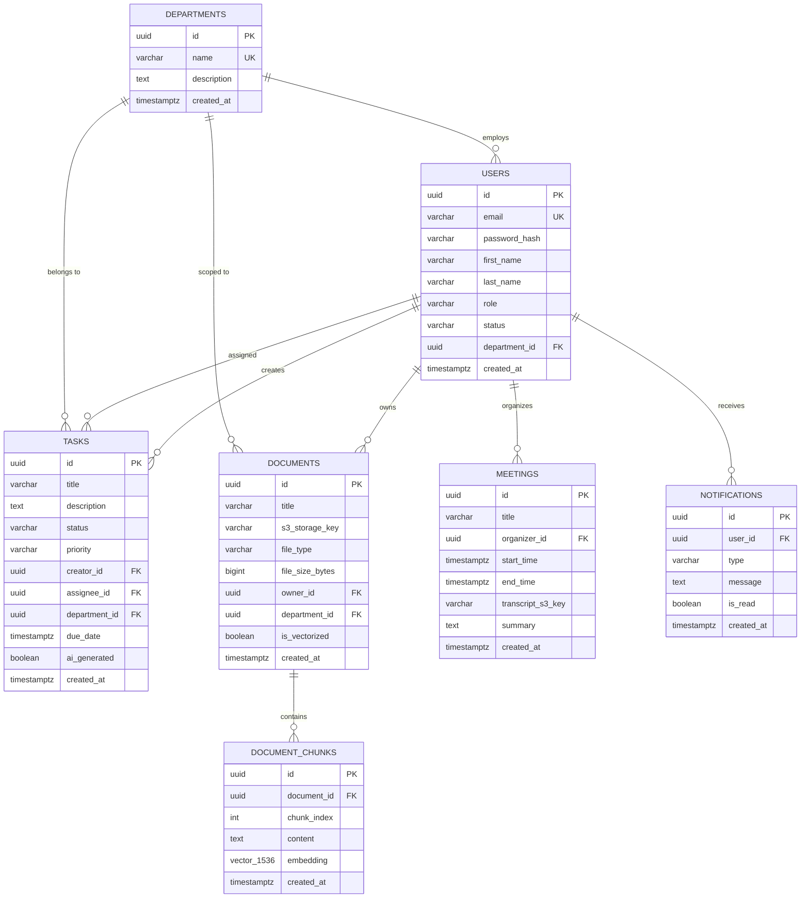

# Entity Relationship Diagram (ERD): PostgreSQL Database Schema

```mermaid
erDiagram
    DEPARTMENTS {
        uuid id PK
        varchar name UK
        text description
        timestamptz created_at
    }

    USERS {
        uuid id PK
        varchar email UK
        varchar password_hash
        varchar first_name
        varchar last_name
        varchar role
        varchar status
        uuid department_id FK
        timestamptz created_at
    }

    TASKS {
        uuid id PK
        varchar title
        text description
        varchar status
        varchar priority
        uuid creator_id FK
        uuid assignee_id FK
        uuid department_id FK
        timestamptz due_date
        boolean ai_generated
        timestamptz created_at
    }

    DOCUMENTS {
        uuid id PK
        varchar title
        varchar s3_storage_key
        varchar file_type
        bigint file_size_bytes
        uuid owner_id FK
        uuid department_id FK
        boolean is_vectorized
        timestamptz created_at
    }

    DOCUMENT_CHUNKS {
        uuid id PK
        uuid document_id FK
        int chunk_index
        text content
        vector_1536 embedding
        timestamptz created_at
    }

    MEETINGS {
        uuid id PK
        varchar title
        uuid organizer_id FK
        timestamptz start_time
        timestamptz end_time
        varchar transcript_s3_key
        text summary
        timestamptz created_at
    }

    NOTIFICATIONS {
        uuid id PK
        uuid user_id FK
        varchar type
        text message
        boolean is_read
        timestamptz created_at
    }

    DEPARTMENTS ||--o{ USERS : "employs"
    USERS ||--o{ TASKS : "creates"
    USERS ||--o{ TASKS : "assigned"
    DEPARTMENTS ||--o{ TASKS : "belongs to"
    USERS ||--o{ DOCUMENTS : "owns"
    DEPARTMENTS ||--o{ DOCUMENTS : "scoped to"
    DOCUMENTS ||--o{ DOCUMENT_CHUNKS : "contains"
    USERS ||--o{ MEETINGS : "organizes"
    USERS ||--o{ NOTIFICATIONS : "receives"
```
