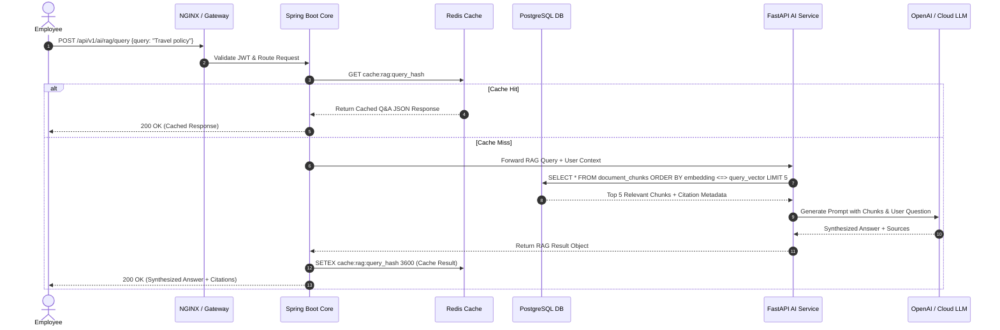

# Sequence Diagram: Request Execution & AI RAG Document Processing

```mermaid
sequenceDiagram
    autonumber
    actor Employee
    participant Gateway as NGINX / Gateway
    participant Spring as Spring Boot Core
    participant Cache as Redis Cache
    participant DB as PostgreSQL DB
    participant AI as FastAPI AI Service
    participant LLM as OpenAI / Cloud LLM

    Employee->>Gateway: POST /api/v1/ai/rag/query {query: "Travel policy"}
    Gateway->>Spring: Validate JWT & Route Request
    Spring->>Cache: GET cache:rag:query_hash
    Alt Cache Hit
        Cache-->>Spring: Return Cached Q&A JSON Response
        Spring-->>Employee: 200 OK (Cached Response)
    Else Cache Miss
        Spring->>AI: Forward RAG Query + User Context
        AI->>DB: SELECT * FROM document_chunks ORDER BY embedding <=> query_vector LIMIT 5
        DB-->>AI: Top 5 Relevant Chunks + Citation Metadata
        AI->>LLM: Generate Prompt with Chunks & User Question
        LLM-->>AI: Synthesized Answer + Sources
        AI-->>Spring: Return RAG Result Object
        Spring->>Cache: SETEX cache:rag:query_hash 3600 (Cache Result)
        Spring-->>Employee: 200 OK (Synthesized Answer + Citations)
    End
```
